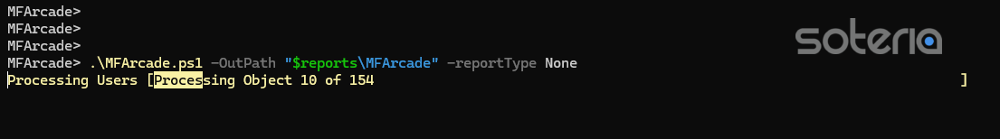
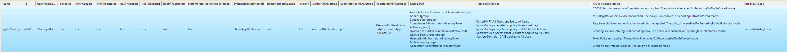
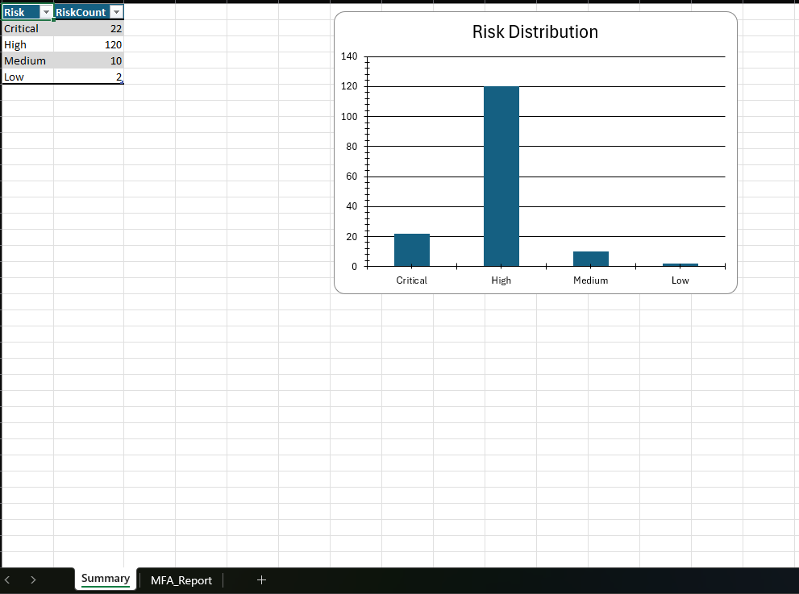
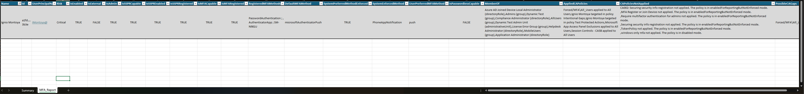
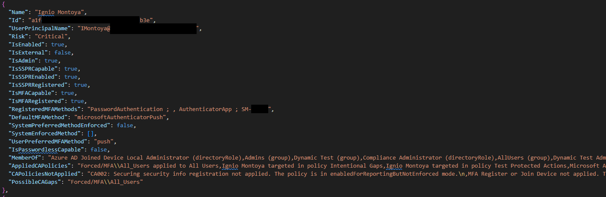

<p align="center">
    
</p>

# MFArcade
MFArcade is a PowerShell script that aims to assist administrators in generating and understanding reports of Microsoft 365 User Multi-factor Authentication Registration Status and highlight MFA Related Conditional Access Policy Gaps.

<p align="center">
    
</p>

## Purpose
MFArcade was created to make it easy for tenant administrators to understand their users' registered MFA methods and identify gaps in Conditional Access Policies. Borrowing from our [Invoke-MFAMethodsReport](https://github.com/soteria-security/Invoke-MFAMethodsReport) we designed MFArcade to give administrators a quick and easy way to generate risk-based reports of user MFA registration methods and find potential CA gaps. The report is sorted by risk, so administrators will be able to easily discern the most at risk users based on their potential CA gaps and the user's MFA configuration, including if the user is registered, if they hold an administrative role in the tenant, all of their registered methods, and the selected default method used to authenticate the user.

## Script Help
```pwsh
<#
.SYNOPSIS
    Generates a risk-based report of user mutli-factor authentication and possible Conditional Access Policy assignment gaps.
.PARAMETER OutPath
    Report destination. Directory input only.
.PARAMETER ReportType
    Desired Report Format. Options are CSV, XML, JSON, EXCEL, HTML, or None (GridView). All may also be specified to create all report types except GridView.
.PARAMETER ShowReport
    Automatically launches the chosen report type.
.EXAMPLE
   .\MFArcade.ps1 -OutPath "$reports\MFArcade" -reportType EXCEL -ShowReport
.EXAMPLE
    .\MFArcade.ps1 -OutPath "$reports\MFArcade" -reportType EXCEL
.EXAMPLE
    .\MFArcade.ps1 -OutPath "$reports\MFArcade" -reportType None
.OUTPUTS
    Desired report output in the defined OutPath parameter.
.LINK
    https://learn.microsoft.com/en-us/azure/active-directory/authentication/howto-authentication-methods-activity
#>
```

## Requirements
The Microsoft Graph Beta and ImportExcel PowerShell modules, and sufficient permissions to run the queries are required. The first time Microsoft Graph requests the necessary permissions, a Global Administrator must grant the permissions request on behalf of the tenant.

### Required Permissions
```
Reports.Read.All
Policy.Read.All
Directory.Read.All
User.Read.All
UserAuthenticationMethod.Read.All
```
### Graph Modules Used
```
Microsoft.Graph.Reports
Microsoft.Graph.Beta.Identity.DirectoryManagement
Microsoft.Graph.Groups
Microsoft.Graph.Beta.Identity.SignIns
ImportExcel
```

## Using the Script
```pwsh
PS C:\> git clone 'https://github.com/soteria-security/Invoke-MFAMethodsReport.git'
PS C:\> cd .\MFArcade
PS C:\> .\MFArcade.ps1 -OutPath "$reports\MFArcade" -reportType None
```

## Generating the Report
```pwsh
# Return full set of results
PS C:\> .\MFArcade.ps1 -OutPath "$reports\MFArcade" -reportType None
       # or
PS C:\> .\MFArcade.ps1 -OutPath "$reports\MFArcade" -reportType JSON
       # or
PS C:\> .\MFArcade.ps1 -OutPath "$reports\MFArcade" -reportType EXCEL
       # or
PS C:\> .\MFArcade.ps1 -OutPath "$reports\MFArcade" -reportType HTML
       # or
PS C:\> .\MFArcade.ps1 -OutPath "$reports\MFArcade" -reportType XML
       # or
PS C:\> .\MFArcade.ps1 -OutPath "$reports\MFArcade" -reportType CSV
```





